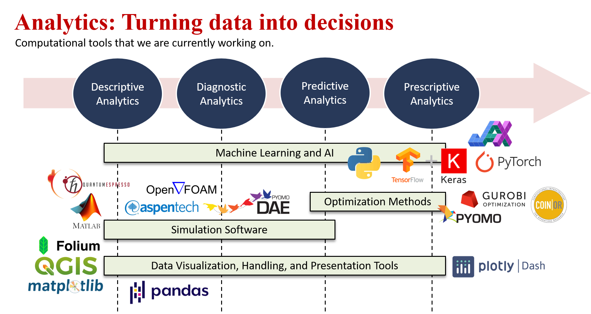

Our projects are typically anchored to various stages in the data analytics pipeline. We have experience in these tools:

    

The following lists our involvement in government- and industry-funded projects:

## Past Projects

* Pilot Study for Integrating Microgrids and Distributed Renewable Energy Sources for an Electric Cooperative (2021)
  * Role: Project Staff
  * Funding agency: DOST CRADLE (Collaborative Research and Development to Leverage the Philippine Economy) Program
* Computational Design of High Entropy Alloys for Catalyst and Battery Applications (2022)
  * Role: Project Staff
  * Funding agency: DOST PCIEERD (Philippine Council for Industry, Energy, and Emerging Technology Research and Development)
  * Won the DOST-PCIEERD Excellence in Project Implementation and Completion (EPIC) Award, June 2026

## Ongoing Projects

* Renewable Energy-Powered Production of Net Zero Energy Carriers: from Emerging Catalysis to Process Engineering (2024)
  * Role: Project Staff
  * Funding agency: DOST PCIEERD (Philippine Council for Industry, Energy, and Emerging Technology Research and Development)
* Two-Year Collaborative Algal Bloom Research (2024)
  * Role: Project Staff
  * Industry Partner: Maynilad Water Services, Inc.

## Open Research Questions
These are some ideas that we are currently working on. If you wish to collaborate with us, e-mail me at kspilario@up.edu.ph

* *Neural Architecture Search*
  * If neural nets are universal approximators, can we train them to behave between 2 machine learning models? What is halfway between a Random Forest model and a Support Vector Machine? Can an autoencoder be trained halfway between t-SNE and PCA?
  * If diffusion models can be trained to generate hyper-realistic images, can we use the same normalizing flows concept to fine-tune and generate effective neural net architectures?
  * Where are the physics-informed neural nets and the non-physics-informed neural nets in the high-dimensional weight space? Can we constrain backpropagation to lead us closer to more physically realizable neural nets without encoding the physics?
  * Are there artifacts about neural net architectures that make them better surrogates for ODEs and PDEs?
  * How do we compress large trained neural nets without sacrificing accuracy?
  * Can neural net generalization be connected to Hessian-based metrics of the loss landscape when applied to the surrogate modeling of industrial processes?
  * Can we make neural net inference faster for surrogate-based optimization and control? How to get its inverse for explicit MPC?
  * Are there artifacts about the statistics of a data set that make certain neural net architectures work better on them?

* *Continual Learning*
  * How can neural nets continuously adapt to non-stationary industrial process behavior, for instance, during process degradation?
  * Can we use the attention mechanism to attend to certain weights that can be adjusted during adaptive inference?
  * Can we design a Kalman filter to adapt any nonlinear machine learning surrogate to changing process conditions at inference time?
  * How to ensure stability in adaptive long short-term memory neural nets?
  * Can we quickly constrain the adaptation of neural nets to remain physics-informed at inference time?
  * Can we use decision trees to guide switching between different machine learning models when tracking changing operating conditions? 
  * Can we train a policy by reinforcement learning that learns to choose various surrogates among an ensemble?

* *Other ideas*
  * Can we train a decision tree with Gaussian Process models at the leaves? Or use trees to mix different kernels?
  * Are there alternatives to current neural operators for PDEs?
  * Can we guide plant, process, or equipment design using diffusion maps and tracing safety-edge cases in the map?
  * Can we measure overparametrization and apply it outside neural nets?
  * Can we knowledge-distill multiple single-output Gaussian processes into multi-output recurrent neural nets?
  * How to make reinforcement learning agents more sample-efficient for optimization and control?
  * Can we measure the effectiveness of domain adaptation of machine learning models in a low-dimensional space?
  
